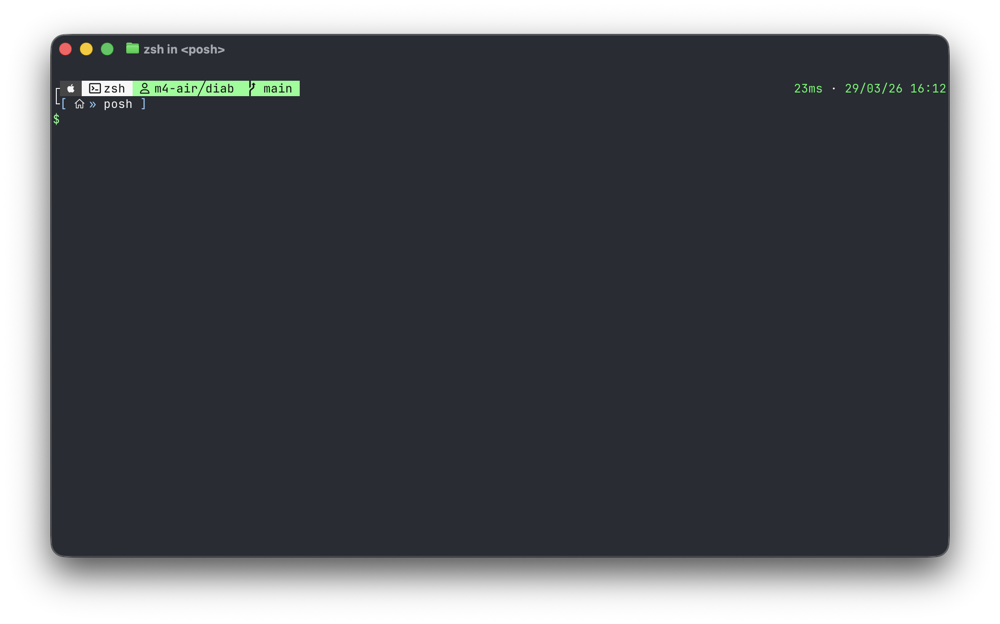

# posh

My custom [Oh My Posh](https://ohmyposh.dev/) theme - a clean, green terminal prompt.



## Features

- OS icon, shell name, hostname/username, and git branch on the first line
- Execution time and timestamp on the right
- Current path on the second line
- Green `$` prompt that turns red on error

## Usage

1. [Install Oh My Posh](https://ohmyposh.dev/docs/installation/linux)
2. Copy `hul10.green.omp.json` to your Oh My Posh themes directory
3. Set it as your theme:
   ```sh
   eval "$(oh-my-posh init zsh --config /path/to/hul10.green.omp.json)"
   ```
